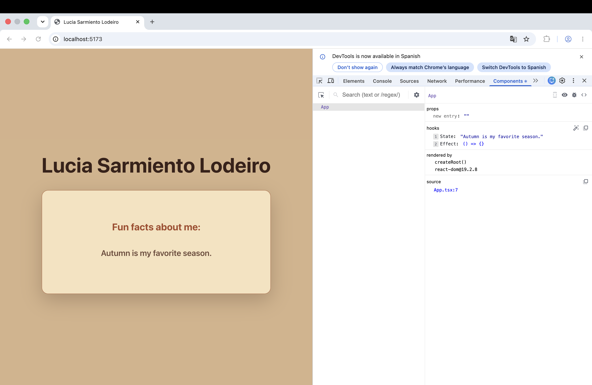

# Work Requirement 1 PRO2001

## How to run the app
- Clone the repository using URL or download ZIP file:
https://github.com/lusarlo/Work_Requirements_PRO1002.git

- Install dependecies on terminal: ```npm install```

- Start development server: ```npm run dev```

## Tools Used
- Visual Studio Code
- React 
- TypeScript
- Vite
- React DevTools on Chrome
- Copilot Chat on VS Code to clarify doubts.

## React DevTools

